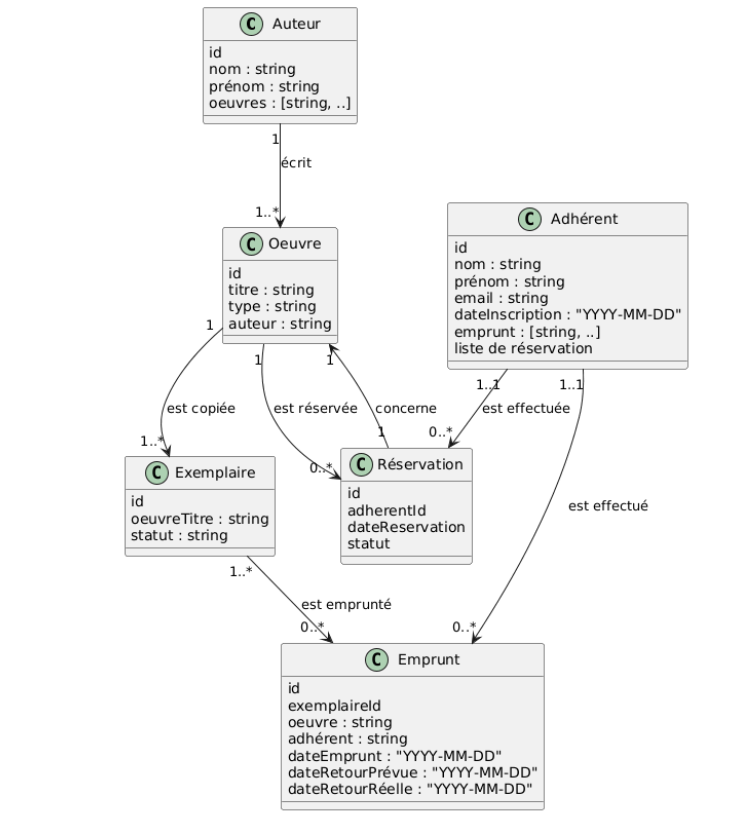
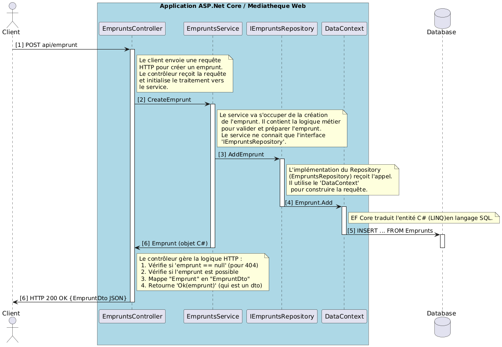

# Création d’un service web pour une médiathèque
## 📝 Documentation Projet Génie Logiciel 2025
Réalisé par :
* 👧🏼 [**DERAMAIX Mathilde**](https://github.com/MathildeDrmx)
* 👧🏻 [**HOUT Dounia**](https://github.com/d-hout) <br>
(Groupe 3)

## Présentation générale du projet

Ce projet consiste à développer un service web back-end fonctionnel pour la gestion administrative et le suivi des oeuvres d'une médiathèque.
Sachant que la médiathèque peut posséder plusieurs exemplaires de chaque œuvre, et ces exemplaires peuvent être empruntés ou réservés par les adhérents.

L'objectif de ce service est de permettre :
- la gestion des adhérents, ainsi que leurs emprunts et réservations.
- le suivi les œuvres disponibles dans la médiathèque, avec la gestion des stocks et de la disponibilité de chaque exemplaire.
- la réservation sou l'emprunt d'œuvres selon leur disponibilité par les adhérents.

Le service doit également assurer la cohérence des données en suivant :
- le nombre d’exemplaires disponibles.
- les emprunts actifs et terminés.
- les réservations actives et leur file d’attente. 

## Procédure d’installation

1. Cloner le dépôt sur votre **machine personnelle** :
   ```
   git clone https://github.com/ensc-glog/glog-classroom-project-douniahout_mathildederamaix.git
   ```

2. Se diriger vers le répertoire du projet dans l'**invite de commande** :
   ```
   cd glog-classroom-project-douniahout_mathildederamaix
   cd MediathequeWeb
   ```

3. Lancer le service web :
   ```
   dotnet build
   dotnet ef database update
   dotnet run
   ```

4. Observer le port du service avec l'adresse **localhost** :
   ```
   http://localhost:7044/api/
   http://localhost:7044/scalar/
   ```
## Diagramme de classe UML 
Ce diagramme présente le modèle métier de l’application et les relations entre les entités, servant de base à la structure des données. Il a été créé avec PlantUML. 



## Diagramme de séquence UML
Ce diagramme montre le déroulement complet du traitement d’un emprunt réussi, depuis la requête du client jusqu’à la persistance en base, en passant par le contrôleur, le service et le repository. Il illustre clairement le rôle de chaque couche dans le flux d’exécution. Il a été créé avec PlantUML.



